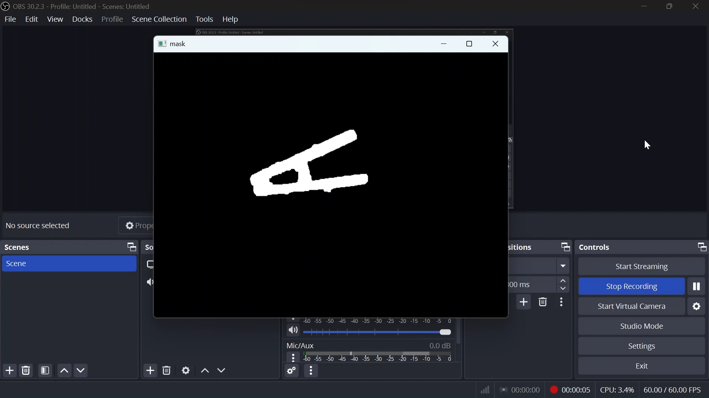
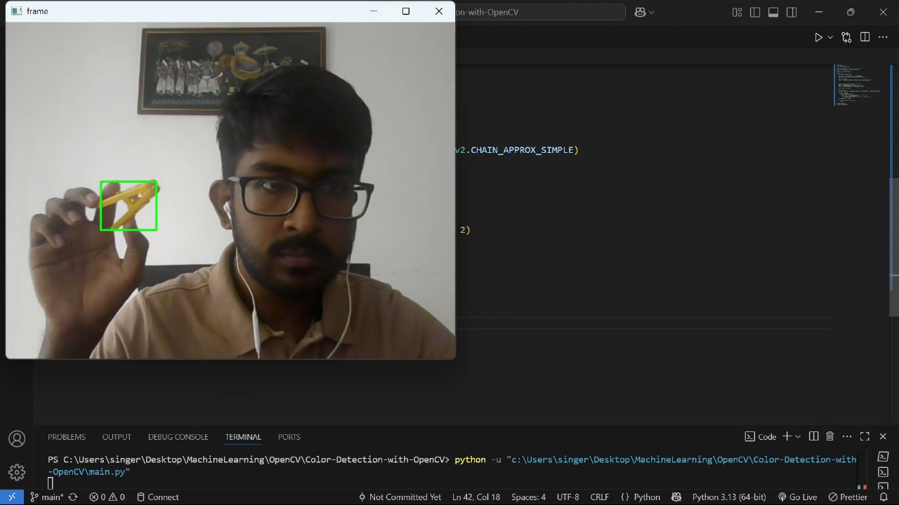

# 🟡 Color Detection with OpenCV

This project detects specific colors in real-time using **OpenCV** and a webcam feed.  
It demonstrates how to convert images to the **HSV color space**, create a color mask, clean it with morphological operations and find contours to detect objects of a chosen color.

---

## 🖼️ Example Output

  

  

## You can view the webcam results from here:  
👉 [Color detection videos](https://uniofmora-my.sharepoint.com/:f:/g/personal/senaweerasahd_22_uom_lk/Ev9sNREWwr1OlNuYvLPOk3sBkwR5IjE2caOAYS17AH_IBw?e=E8OVCU)

